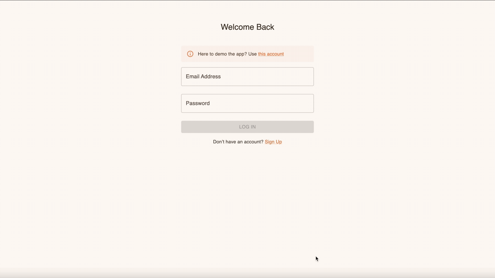
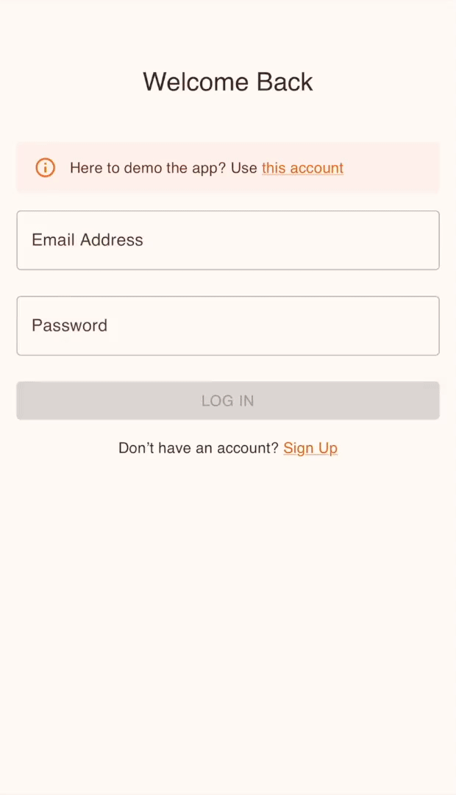

# MindScape 🧠✏️ (A Journal with Built-In Sketching Tools)

**Project's Backend:** https://github.com/FiorenNathasia/mindscape-backend

### 💻 Desktop View

### 📱 Mobile View

---

## 🧠 Overview

**Mindscape** is a journaling app that combines text entries with freeform sketching tools, helping users capture ideas visually and flexibly.

---

## 🔍 How is it done?

- Provides a responsive sketching tool using the HTML Canvas element

- Supports both touch and mouse inputs for seamless drawing

- Users can select colors and adjust stroke width for personalized sketches

- Sketches are saved as base64-encoded images tied to each journal entry

- Entries support updating, clearing, or redoing sketches before saving

---

## 🚀 Features

- **✍️ Integrated Sketching:** Draw directly within journal entries with customizable brushes

- **📱 Responsive Design:** Works smoothly on both desktop and mobile devices

- **💾 Persistent Storage:** Sketches and texts saved reliably using PostgreSQL

- **🔐 Secure Authentication:** User login and sessions managed with JWT and OAuth

---

## 🛠️ Tech Stack

- **Frontend:** React (with responsive design) & HTML Canvas (for sketching interactions)
- **Backend:** Express.js
- **Database:** PostgreSQL
- **Authentication:** JWT (OAuth)

---
